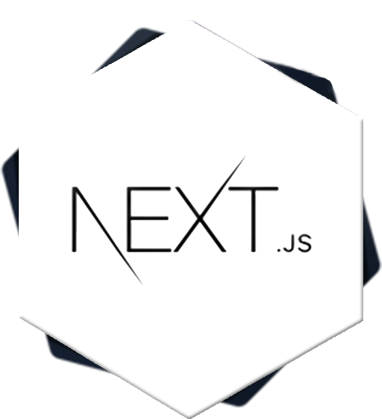

<div align="center" style="margin-bottom: 20px;">
  <div>
    
    <h1>NEXTJS BOILERPLATE</h1>
  </div>
  <div align="center">
    
    
    
    
    
  </div>
</div>

## About this project
This is a boilerplate to be use in your project with tecnologies NextJS, TypeScript, Storybook, Styled-components, Jest & React-testing-library.

## Technologies
- [TypeScript](https://www.typescriptlang.org/)
- [NextJS](https://nextjs.org/)
- [Styled Components](https://styled-components.com/)
- [Jest](https://jestjs.io/)
- [React Testing Library](https://testing-library.com/docs/react-testing-library/intro)
- [Storybook](https://storybook.js.org/)
- [Eslint](https://eslint.org/)
- [Prettier](https://prettier.io/)
- [Husky](https://github.com/typicode/husky)

## Run this project
```bash
# Creating your project using this boilerplate
$ yarn create next-app -e https://github.com/jefferson1104/boilerplate-nextjs PROJECT_NAME

# Project directory
cd PROJECT_NAME

# Install dependencies
$ yarn

# Run project
$ yarn dev
```

## Commands
- `yarn dev`: run application on `localhost:3000`
- `yarn build`: creates the production build version
- `yarn start`: starts a simple server with the build production code
- `yarn lint`: runs ESLint to test all components and pages
- `test`: run Jest to test all components and pages
- `test:watch`: run Jest to test in watch mode
- `yarn storybook`: run storybook on `localhost:6006`
- `yarn generate`: create the component structure in an automated way


## Init Husky in your project
Execute command: `npx husky-init && yarn`

In the **pre-commit** file inside the .husky directory **.husky/pre-commit** Change line content `npm test` to `npx --no-install lint-staged`
